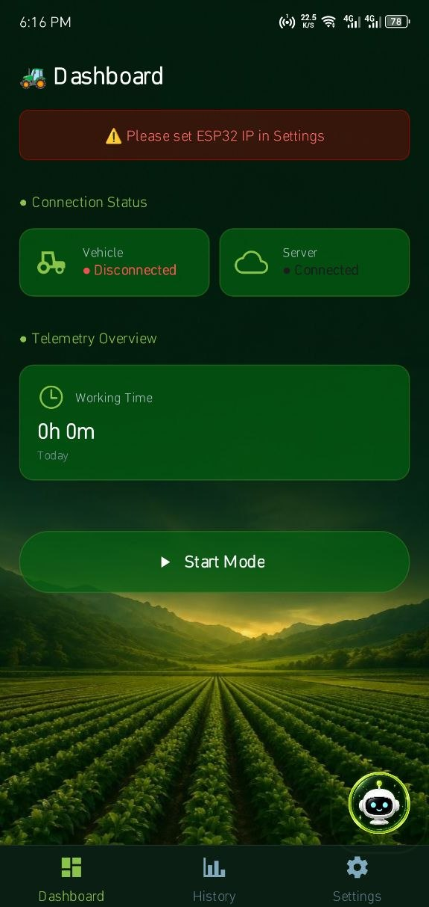
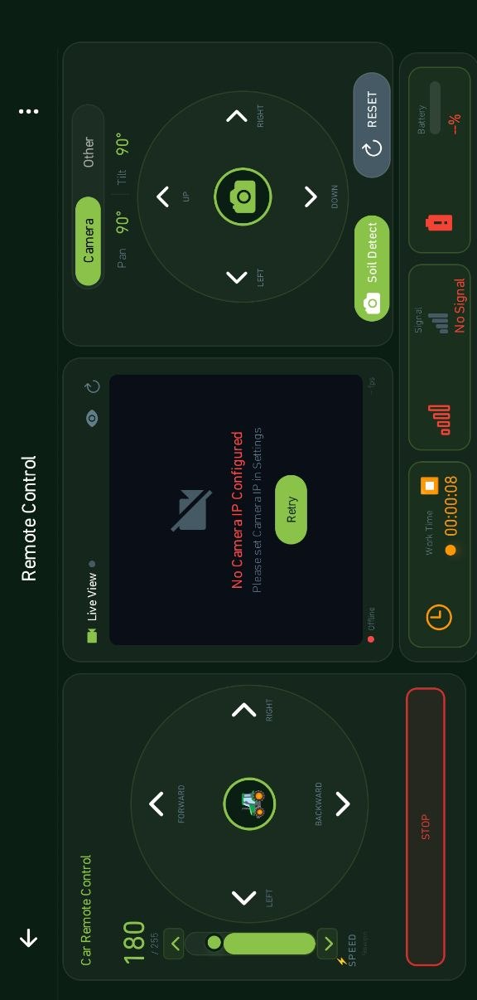
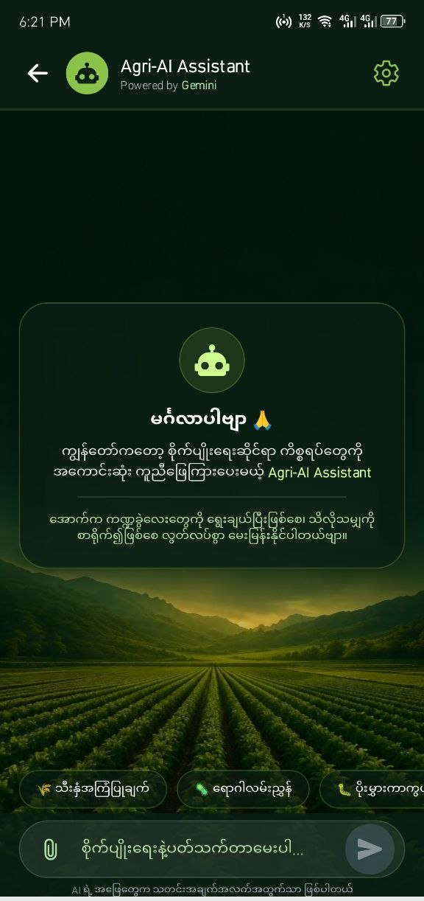
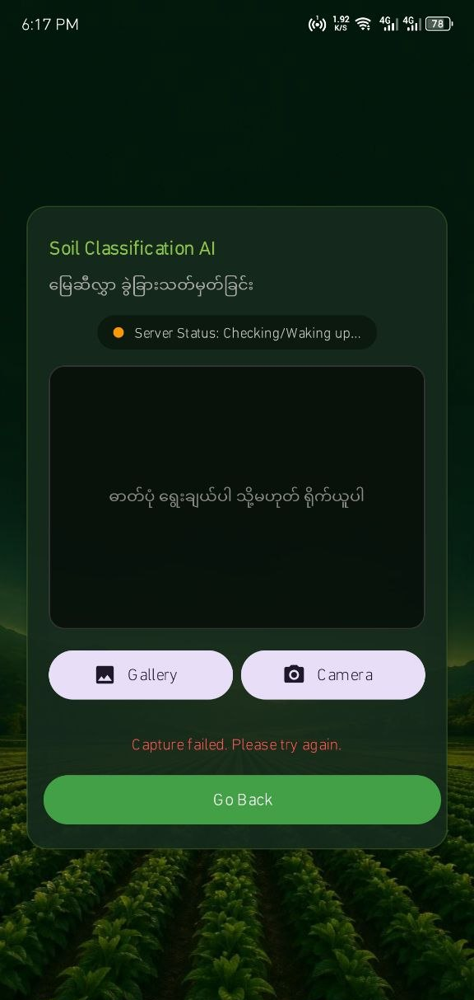

# 🌱 AgriBot - Smart Agriculture Robot Control App

<div align="center">

**A React Native application for smart agriculture robot control, soil detection, and AI-powered farming assistance.**

[](https://reactnative.dev/)
[](https://expo.dev/)

</div>

---

## 📖 About the Project

**AgriBot** is a mobile application developed with **React Native and Expo** for controlling and monitoring an agricultural robot.

The application provides robot control, real-time telemetry, camera monitoring, soil detection, plant disease detection, and an AI-powered farming assistant.

The app is designed to help farmers monitor agricultural conditions and interact with a smart farming robot through a mobile device.

---

## ✨ Features

### 🚜 Robot Control

* Forward, backward, left, and right movement control
* Camera pan/tilt control
* Live camera monitoring
* WiFi / ESP32 connection status

### 📊 Dashboard & Telemetry

* Real-time battery information
* Temperature monitoring
* Humidity monitoring
* Soil detection
* Robot working time
* Connection status

### 🤖 AI Farming Assistant

* AI-powered farming assistance
* Farming-related question and answer
* Chat history
* Quick access through floating AI button

### 🌱 Plant Scanner

* Take photos using the camera
* Select images from the gallery
* Plant disease detection
* TensorFlow Lite model integration

### 📜 History

* AI chat history
* ESP32 sensor history
* Summary information

### ⚙️ Settings

* WiFi configuration
* API endpoint configuration
* Application preferences

---

## 📱 Download APK

You can download and install the **AgriBot Android APK** from Google Drive.

### 👉 [Download AgriBot APK](https://drive.google.com/file/d/1XMpyUGSFpECHoxn0-2_AAKxWXADtVVpF/view?usp=drive_link)

> **Note:** The Google Drive file must be shared as **Anyone with the link → Viewer** so that users can access the APK.

---

## 📸 Screenshots

Add your application screenshots here.

| Dashboard                               | Robot Control                       | AI Chat                             | Plant Scanner                       |
| --------------------------------------- | ----------------------------------- | ----------------------------------- | ----------------------------------- |
|  |  |  |  |

---

## 🛠️ Technology Stack

### Core

* React Native `0.85.3`
* Expo `~56.0.15`
* React `19.2.3`

### Navigation

* React Navigation
* Bottom Tab Navigation
* Stack Navigation

### AI & Machine Learning

* TensorFlow.js
* TensorFlow Lite
* React Native Fast TFLite
* Google Gemini AI

### Camera & Media

* React Native Vision Camera
* Expo Image Picker
* Expo Media Library

### Backend & Networking

* Axios
* Socket.IO Client
* Firebase

### UI & Animation

* React Native Paper
* React Native Reanimated
* React Native Gesture Handler
* Expo Vector Icons

### Storage

* Async Storage

---

## 📁 Project Structure

```text
frontend/
├── assets/
│   ├── audio/
│   ├── models/
│   └── ...
│
├── src/
│   ├── components/
│   │   ├── common/
│   │   ├── control/
│   │   ├── dashboard/
│   │   └── History/
│   │
│   ├── constants/
│   │   └── apiConfig.js
│   │
│   ├── context/
│   │   └── WifiContext.js
│   │
│   ├── hooks/
│   │   ├── useCamera.js
│   │   ├── useCarControl.js
│   │   ├── useDashboard.js
│   │   ├── useRobot.js
│   │   └── useSoilDetection.js
│   │
│   ├── lib/
│   │   ├── api/
│   │   └── firebase.js
│   │
│   ├── screens/
│   │   ├── DashboardScreen.js
│   │   ├── ControlScreen.js
│   │   ├── AIChatScreen.js
│   │   ├── HistoryScreen.js
│   │   └── SettingsScreen.js
│   │
│   └── services/
│       ├── esp32Service.js
│       ├── firebaseService.js
│       ├── geminiProxyService.js
│       └── wifiService.js
│
├── App.js
├── app.json
├── eas.json
├── index.js
├── metro.config.js
└── package.json
```

---

## 🚀 Installation

### Prerequisites

Make sure the following tools are installed:

* Node.js v18 or higher
* npm or yarn
* Expo CLI
* EAS CLI
* Expo account

### Clone the Repository

```bash
git clone https://github.com/KyawZayYa-c/Agribot-App.git
```

```bash
cd Agribot-App
```

### Install Dependencies

```bash
npm install
```

### Start the Development Server

```bash
npx expo start
```

You can then run the application using an Android device or emulator.

---


> ⚠️ **Important:** Never commit your `.env` file or private API keys to GitHub.

Add `.env` to `.gitignore`.

---

## 📦 Building the APK

This project uses **EAS Build** to create the Android APK.

### Login to Expo

```bash
eas login
```

### Configure EAS

```bash
eas build:configure
```

### Build APK

```bash
eas build -p android --profile preview
```

After the build is completed, the APK can be downloaded from the EAS build page.

---

## 📱 How to Use

### 1. Connect to the Robot

Open the **Settings** screen and configure the WiFi connection to the ESP32 robot.

### 2. View Dashboard

The Dashboard provides:

* Battery information
* Temperature
* Humidity
* Soil detection results
* Robot connection status

### 3. Control the Robot

Open the **Control** screen and use the directional controls to operate the robot.

Camera pan/tilt can also be controlled from the application.

### 4. Use AI Assistant

Open the **AI Chat** screen or tap the floating AI button to ask farming-related questions.

### 5. Scan Plants

Open the **Plant Scanner**, take a photo or select an image from the gallery, and run plant disease detection.

---

### 🌐 Portfolio — [Kyaw Zay Ya](https://kyawzayya.vercel.app)

## 🔗 Project Links

### GitHub Repository

👉 **[AgriBot-App GitHub Repository](https://github.com/KyawZayYa-c/Agribot-App)**

### Android APK

👉 **[Download AgriBot APK from Google Drive](https://drive.google.com/file/d/1XMpyUGSFpECHoxn0-2_AAKxWXADtVVpF/view?usp=drive_link)**

---

## 🤝 Contributing

Contributions are welcome.

1. Fork the repository
2. Create a feature branch

```bash
git checkout -b feature/AmazingFeature
```

3. Commit your changes

```bash
git commit -m "Add some AmazingFeature"
```

4. Push the branch

```bash
git push origin feature/AmazingFeature
```

5. Open a Pull Request

---

## 📄 License

This project is licensed under the **MIT License**.

---

## 🙏 Acknowledgments

* React Native
* Expo
* TensorFlow Lite
* Google Gemini
* Firebase
* React Navigation
* React Native Paper

---

<div align="center">

### 🌱 AgriBot

**Smart Technology for Smart Agriculture**

Made with ❤️ using React Native

</div>
